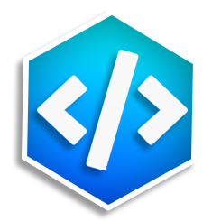

<h1 align="center">
  
    CodePrep
</h1>

 <b> CodePrep helps you prepare for your coding interviews </b> 

## :zap: Installation  

CodePrep **requires** _nodejs_ (and aditionally npm). If you don't already have it installed it you can download it **[here.](https://nodejs.org/en/)**    
**1.** Fork this repository  
**2.** Clone the repository and extract the zip file  
**3.** Using a terminal, `cd` into the file repository  
**4.** Run `npm install` to install the dependencies *(dependencies are listed below)*  
**5.** Run `npm start` or `nodemon` to launch the **demo** CodePrep application

## :open_file_folder: Dependencies
This application is built using the following npm Packages. The codeprep package.json file can be found **[here](https://github.com/code-prep/application/blob/master/package.json)**

- **[bcrypt.js:](https://github.com/kelektiv/node.bcrypt.js)** Library to help you hash passwords - Optimized bcrypt in JavaScript with zero dependencies. Compatible to the C++ bcrypt binding on node.js and also working in the browser.

- **[body-parser:](https://github.com/expressjs/body-parser)** Node.js body parsing middleware - Parse incoming request bodies in a middleware before your handlers, available under the req.body property.

- **[connect-flash:](https://github.com/jaredhanson/connect-flash)** The flash is a special area of the session used for storing messages. Messages are written to the flash and cleared after being displayed to the user. The flash is typically used in combination with redirects, ensuring that the message is available to the next page that is to be rendered.

- **[express:](https://github.com/expressjs/express)** Fast, unopinionated, minimalist web framework for node.

- **[express-handlebars:](https://github.com/ericf/express-handlebars)** A Handlebars view engine for Express which doesn't suck.

- **[express-session:](https://github.com/expressjs/session)** Simple session middleware for Express

- **[method-override:](https://github.com/expressjs/method-override)** Lets you use HTTP verbs such as PUT or DELETE in places where the client doesn't support it.

## :camera: Screenshot

  

 ...
   2019 <a href="https://github.com/Furqan17"><strong>Furqan17</strong></a>
    Licensed under <a href="https://github.com/code-prep/application/blob/master/LICENSE">MIT</a>

